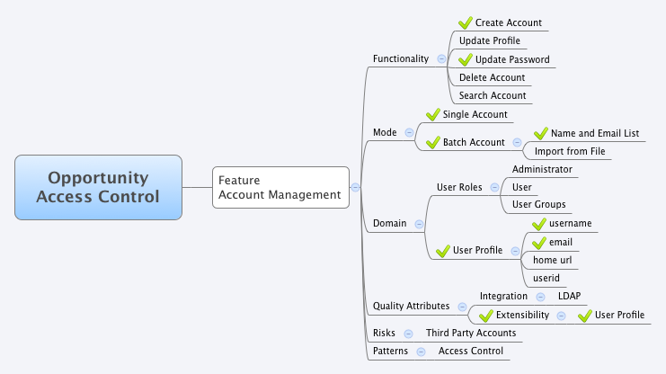
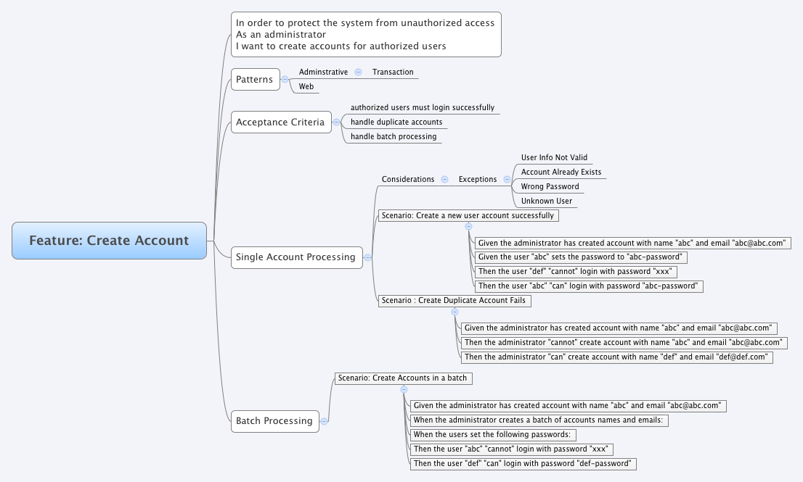

ac-10-Explore
=============

This is the tenth part of the access-control cucumber-jvm example series.

### req - explore requirements in terms of scope and acceptance
* access-control.xmind - A Mindmap using xmind to explore requirements
* Feature-Exploration.png - an exported png to show exploration of access control features
* 01-Create-Account.png - an exported png to show exploration of Create Account scenarios 

Feature-Exploration.png

01-Create-Account.png

